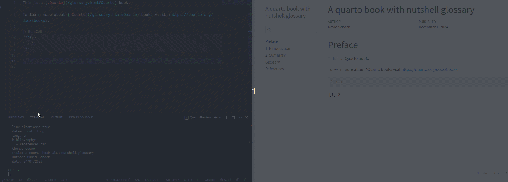

# Automatic Glossary for Quarto with nutshell

This repo shows an example for how to create a glossary using the quarto
extension [nutshell](https://github.com/schochastics/quarto-nutshell).



## glossary file

Create a `glossary.md` file for your project with terms as second level headings
and their explanation as a paragraph below

```md
# Glossary

## Quarto

Quarto is an open-source scientific and technical publishing system built on Pandoc

```

## prerender script

The prerender script `glossary.R` looks as follows

```r
files <- Sys.getenv("QUARTO_PROJECT_INPUT_FILES")
glossary <- readLines("glossary.md")
terms <- glossary[stringr::str_detect(glossary, "^## ")] |> stringr::str_remove_all("## ")

for (f in files){
    if (f != "glossary.md"){
      co <- readLines(f)
      if (any(stringr::str_detect(co, paste0(terms, collapse = "|")))) {
          print(f)
          co <- stringi::stri_replace_all_regex(co, paste0("(?<![:#])", terms),
              paste0("[:", terms, "](/glossary.html#", terms, ")"), vectorize_all = FALSE)
          writeLines(co, f)
      }
    }
}
```
The script reads all files that are to be rendered and replaces every term from
the glossary with a nutshell link. For our example, all instances of `Quarto`
turn into `[:Quarto](/glossary.html#Quarto)`. **It thus changes all input
files**.

Add the script to `_quarto.yml` like this

```yml
project:
  type: book
  pre-render: glossary.R
```

## Disclaimer

The pre-render R script is not perfect and still struggles with some cases.
Also, I am not sure if a pre-render script is the best solution for this.
Probably a lua filter would make more sense, but my lua skills are still limited.